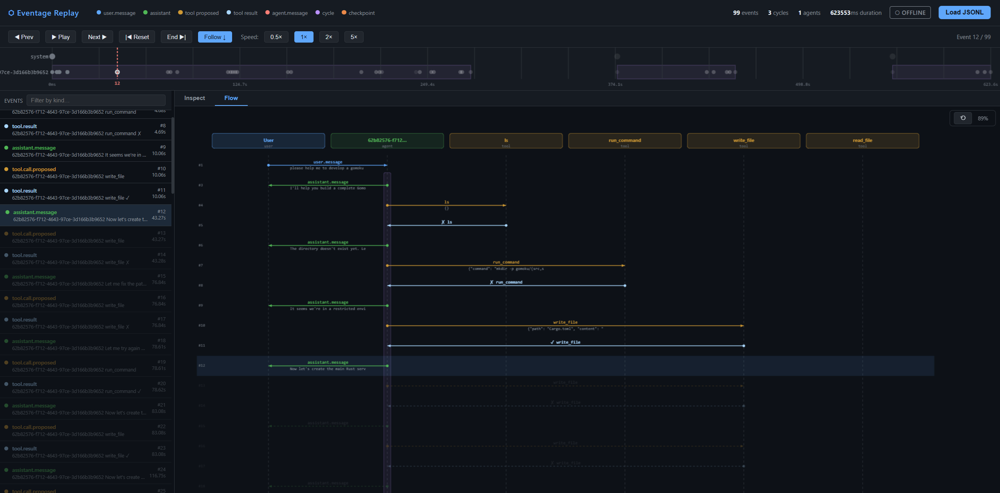

# Eventage

[](LICENSE)

Eventage is an event-driven agent framework for Rust. It provides modularity and complete observability to build everything from simple chatbots to highly complex, multi-agent coding systems.

In Eventage, **everything that happens in the system is an event on a shared bus.**

Human inputs, LLM generated contents, tool executions, and inter-agent routing are all emitted as events over an append-only, Directed Acyclic Graph (DAG) log called the `EventBus`.

This design inherently decouples the system. It enables precise reproducibility, fault tolerance, live observability, speculative branching (DAG rollback), and effortless multi-agent concurrency.

---

## The Architecture at a Glance

In Eventage, an agent subscribes to the `EventBus` and makes decisions using an LLM. Because the bus is the central nervous system, independent entities — like Background Workers or Observability exporters — can easily live on the exact same bus without getting in the agent's way.

```text
┌─────────────────────────────────────────────────────────────┐
│                          EventBus                           │
│          (append-only DAG log + broadcast channel)          │
└─┬─────────────────────────────▲───────────────────────────┬─┘
  │ subscribe                   │ publish                   │ subscribe
  │                             │ (e.g. `system.heartbeat`) │
  ▼                             │                           ▼
┌─┴─────────────────────────────┴─────────────────┐  ┌──────┴──────────────┐
│                     Agent                       │  │                     │
│               (LLM intelligence)                │  │    EventWorker      │
│ 1. Agent::run() wakes on `user.message`, etc.   │  │ (Automation Harness)│
│                                                 │  │ e.g. HeartbeatRunner│
│ 2. Agent::cycle()                               │  └─────────┬───────────┘
│ ├── Publish `agent.cycle.start`                 │            │ publish
│ │                                               │  ┌─────────┴───────────┐
│ └── 3. ExecutionStrategy (e.g. ReactStrategy)   │  │                     │
│     │                                           │  │    Observability    │
│     ├── loop:                                   │  │   (JSONL, Otel)     │
│     │   ├── a. CycleHook::before_step()         │  │ e.g. JsonlExporter  │
│     │   ├── b. ContextAssembler::assemble()     │  └─────────────────────┘
│     │   │      (e.g. DefaultContextAssembler)   │
│     │   ├── c. CycleHook::before_llm()          │
│     │   ├── d. ToolSelector::select()           │
│     │   ├── e. LlmProvider::complete()          │
│     │   │      (e.g. OpenAiProvider)            │
│     │   ├── f. Publish `assistant.message`      │
│     │   │                                       │
│     │   └── g. For each Tool Call:              │
│     │       ├── Publish `tool.call.proposed`    │
│     │       ├── CycleHook::before_tool()        │
│     │       │   (e.g. StdinApprovalGate for     │
│     │       │    human-in-the-loop)             │
│     │       ├── Tool::execute() (concurrent)    │
│     │       │   (e.g. McpTool, SandboxTool)     │
│     │       ├── CycleHook::after_tool()         │
│     │       └── Publish `tool.result`           │
│     │                                           │
│     └── Publish `agent.cycle.end`               │
└─────────────────────────────────────────────────┘
```

Because every internal stage is abstracted behind a trait in `eventage-agent` (Context Assemblers, Strategies, Hooks, LLM Providers, and Tools), the entire reasoning loop is perfectly pluggable.

---

## 💡 Key Capabilities

Because Eventage uses an append-only DAG instead of hidden mutable state arrays, you gain incredible capabilities simply by interacting with the `EventBus`.

### 1. Zero-Cost Speculative Execution (DAG Rollback)
If an agent makes a mistake, you don't need to try and manually delete messages from the end of an opaque array. You simply rollback the DAG to a known safe point. The failed trajectory is automatically sealed as a "rejected branch" that the agent can later learn from.

```rust
// Mark a safe point before telling the agent to do something risky
let safe_point_id = bus.checkpoint().await?;

// ...Agent attempts an unsafe external operation and fails...
bus.publish(Event::new("tool.result", json!({ "error": "compile failed" }))).await?;

// Roll back the graph! The active branch instantly reverts, and all
// failed events are cleanly snipped off into a "rejected" trajectory.
bus.rollback(safe_point_id).await?;

// We can now pass those rejected trajectories to the LLM context assembler
// so the agent inherently knows "I tried that before, and it didn't work."
```

### 2. Live, Invisible Observability & Interception
Want to watch exactly what an agent is doing in real-time, or pause it to inject a RAG document? You don't have to rewrite the agent. You just attach a subscriber to the bus, or a `CycleHook`.

```rust
// 1. Instantly stream every thought, heartbeat, and tool call to a file
let exporter = JsonlExporter::new(std::fs::File::create("agent_log.jsonl")?);
tokio::spawn(async move {
    exporter.observe(bus.clone()).await; 
});

// 2. Or attach a Hook to pause the agent mid-thought for human approval
AgentBuilder::new()
    .bus(bus)
    .llm(openai)
    .hook(StdinApprovalGate) // Wait for a human to type "y" in the terminal before running a tool
    .build();
```




### 3. Effortless Multi-Agent Swarms
Boot up multiple independent agents on the same or separate `EventBus`. Because the bus is the single reliable source of truth, agents organically share a context graph and can route messages to each other asynchronously without writing complex peer-to-peer networking logic.

### 4. Sandboxing
When an agent decides to compile arbitrary C code or run a shell script, Eventage natively supports wrapping those tool executions in strict, pluggable secure contexts via the `eventage-sandbox` crate — out-of-box options ranging from lightweight local Kernel restrictions (`LandlockExecutor`) to process isolation (`DockerExecutor`).

---

## ⚡ Getting Started

The quickest way to get an agent off the ground is using the **Session API** provided by `eventage-provided-impl`, which wraps an internal `EventBus` and `Agent` away behind a clean chat interface.

```toml
[dependencies]
eventage-core = "0.1"
eventage-provided-impl = "0.1"
eventage-llm = "0.1"
tokio = { version = "1", features = ["full"] }
```

```rust
use eventage_provided_impl::Session;
use eventage_llm::OpenAiProvider;

#[tokio::main]
async fn main() -> anyhow::Result<()> {
    // 1. Build a session with an Ollama provider
    let mut session = Session::builder()
        .llm(OpenAiProvider::ollama("qwen3:4b"))
        .system_prompt("You are a concise, helpful assistant.")
        // .tool(MyCustomTool)
        .build();

    // 2. Chat with the agent
    // Under the hood, this publishes a `user.message` to the EventBus,
    // runs the `ReactStrategy` loop, and awaits the final `assistant.message`.
    let reply = session.chat("What is the capital of France?").await?;
    println!("Agent: {reply}");

    Ok(())
}
```

## 📚 Documentation & Examples

For a deep dive into the framework's mechanics — from low-level bus routing, to SQLite DAG persistence, OpenTelemetry exports, and Docker-bound landlocked execution environments — refer to the exhaustive [Developer Guide](docs/DEV-GUIDE.md) and [API Reference](docs/API.md).

You can also explore the `crates/` directory to see production-grade examples built natively with Eventage:
*   `example-basic-chat` — Multi-turn standard chat using the Session API.
*   `example-workflow` — Sequential PRD-writing pipeline with human review.
*   `example-multi-agent` — Orchestrator-and-Worker routing inside an `AgentSet`.
*   `example-clang-agent` — Advanced C-programming showcase proving complex OS-level sandboxing interactions.

